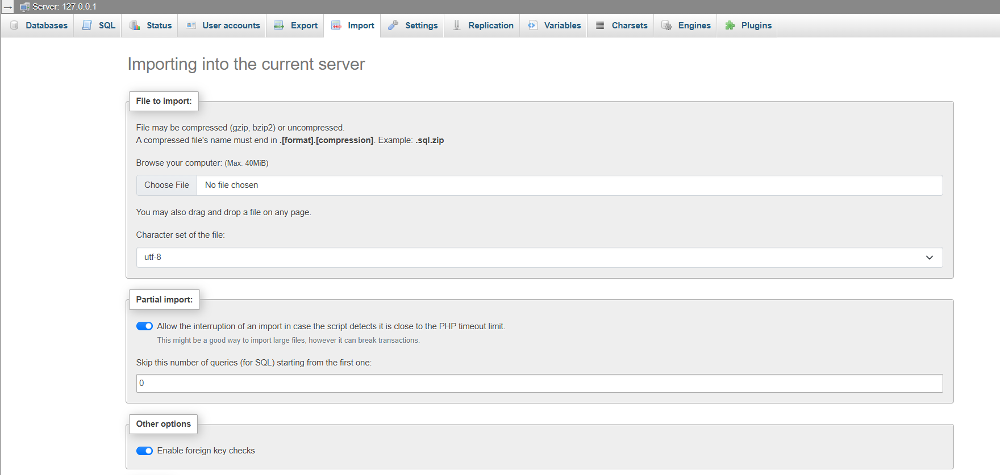
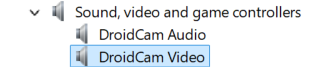

# 🚗 Campus Vehicle Recognition System

A real-time vehicle monitoring solution for campus security, 
combining **DroidCam video capture** and **AI-powered processing** for campus security with web-based management.

## ✨ Key Features
- 📱 **Mobile Camera Integration**
  - Live streaming via DroidCam (Wifi)
  - Web-based video capture
- 🤖 **AI-Powered Detection**
  - Vehicle/license plate detection (YOLOv8)
  - OCR recognition (PaddleOCR)
  - Object tracking (SORT)
- 💾 **Data Management**
  - MySQL database for detection history
  - Registered vehicle database
  - Registered security personnel database
- 🌐 **Web Dashboard**
  - Real-time monitoring
  - Vehicle and security personnel registration system
  - Detection history review
## 🛠️ Tech Stack

| Category       | Technologies                                                                 |
|----------------|-----------------------------------------------------------------------------|
| **Video Input** |  |
| **Detection**  |  |
| **OCR**        |        |
| **Backend**    |   |
| **Frontend**   |   |
| **Database**   |  |


## 🚀 Installation Guide

### Prerequisites 
  
[Download Python 3.8+](https://www.python.org/downloads/)  
**During installation, check "Add Python to PATH"*

  
[Download XAMPP](https://www.apachefriends.org/)  
**Includes Apache, MySQL, and PHP*

  
[Download DroidCam for PC](https://droidcam.app/)[Download DroidCam for PC](https://droidcam.app/)  
[Download DroidCam for Phone](https://play.google.com/store/apps/details?id=com.dev47apps.obsdroidcam&hl=en)  
**Both PC and Phone need to download DroidCam*

  
[Download git](https://git-scm.com/downloads)

### Step-by-Step Setup
1. **Database setup**

Open **XAMPP Control Panel**, start **Apache and MySQL**. Click on **MySQL's Admin**. Go to the import field and import the **campus_security_system.sql** file provided.



2. **Clone the repository or Download the zip file** 

If you want to clone the repository, ensure that **git** is downloaded. Then execute the following commands:

   ```bash
   cd C:\xampp\htdocs
   git clone https://github.com/stupidFLOWERch/campus_security_system.git
   ```
 
If you download the zip file, unzip it to the location **C:\xampp\htdocs**

3. **DroidCam setup**

Open DroidCam Client on PC and DroidCam on phone. Change the **WiFi IP and DroidCam Port** in DroidCam Client to match with the one shown in yur phone DroidCam. 

*Make sure you enable DroidCam Video in your PC Device Manager . If not, you will not be able to view the video capture by your phone on the web interface.

*To enable it, go to **Device Manager** and find **DroidCam Video** under **Sound, video and game controllers** section.



4. **Start Flask Server**

Execute the following command:
```bash
   cd C:\xampp\htdocs\campus_security_system\flask_server
   python server.py
```

5. **Open Web Interface**

Open your web browser and enter **http://localhost/campus_security_system/website/login.php** or click on the link. The preset **username** is **ab**c and **password** is **123**.

*Noted that **C:\xampp\htdocs** is the default installation location for XAMPP. Change the path to **path\xampp\htdocs** if you installed it to other location, which path is the file location where XAMPP is installed.
